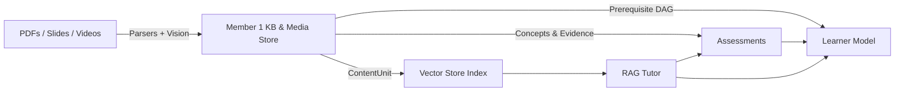

# Multimodal AI Hackathon 2026

## Track D — Personalized Tutoring & Adaptive Learning

## Overview
Build an AI study companion that unifies lecture videos, textbooks, and slides into a source-cited knowledge base, and uses it to run adaptive assessments and personalized tutoring.

## Core Features
- **Unified Multimodal Knowledge Base (Member 1):** Ingests textbook PDFs, PowerPoint slide decks (PPT/PPTX), and lecture videos without manual preprocessing, preserving exact provenance (page, slide, timestamp ranges).
- **Diagram & Figure Understanding (Member 1):** Extracts figures and visual diagrams with coordinate bounding boxes, generating semantic explanations and concept associations.
- **Taxonomy & Prerequisite DAGs (Member 1):** Hierarchically organizes material into Topics, Subtopics, and Concepts; discovers prerequisite dependencies and computes pedagogical learning paths with cycle detection.
- **Generative RAG Tutor Layer (Member 2):** Built with strict evidence-gating to prevent hallucination, enforcing source citations.
- **Adaptive Assessments (Member 3):** Grounded questions backed directly by course material and concept evidence.
- **Learner Model (Member 4):** Maintains long-term student mastery tracking and weakness topic modeling.

## System Architecture



## Project Structure
- `backend/app/ingestion/` - Multimodal parsers (PDF, PPTX, Video/Whisper), vision analysis, semantic chunking, and taxonomy extraction.
- `backend/app/kb/` - Knowledge base models, graph store (prerequisite DAGs), and media asset store.
- `backend/app/tutor/` - RAG tutor logic, evidence gating, and citation validation.
- `backend/app/api/` - REST API routes for ingestion, search, concepts, prerequisites, and tutor interaction.
- `docs/` - Central project integration and architecture documentation.
- `scripts/` - Ingestion, seeding, and automated evaluation scripts.

## Prerequisites
- Python 3.10+
- (Optional) `google-genai` capable API Key for live testing (deterministic offline hashing embedder & mock LLM available for offline dev).

## Environment Variables
The application uses the `GEMINI_API_KEY` for generative capabilities. 

Example only (place in `backend/.env`):
```env
GEMINI_API_KEY=your_gemini_api_key_here
```
*(Never include the real key in source code).*

## Local Setup

### Running the Backend

1. Navigate to the backend directory:
   ```powershell
   cd backend
   ```
2. Set the Python path:
   ```powershell
   $env:PYTHONPATH="."
   ```
3. Start the application:
   ```powershell
   uvicorn app.main:app --port 8000
   ```
   The API will be available at `http://localhost:8000` (docs at `http://localhost:8000/docs`).

### Seeding Multimodal Course Materials

To populate the Knowledge Base with sample textbook PDFs, slide decks, and video lecture segments:
```powershell
cd backend
$env:PYTHONPATH="."
python scripts/seed_multimodal.py
```

### Running the Frontend
*Frontend setup commands are NOT YET IMPLEMENTED.*

## Testing

Run unit and integration test suites:
```powershell
cd backend
$env:PYTHONPATH="."
pytest tests/ -v
```

Run specific test modules:
```powershell
# Member 1 tests (parsers, provenance, chunking, prerequisite DAGs)
pytest tests/test_member1_pipeline.py -v

# Member 1 end-to-end integration test (multimodal files -> vector search)
pytest tests/test_end_to_end_ingestion.py -v

# Member 2 grounding tests
pytest tests/test_grounding.py -v

# End-to-end query verification script
python scripts/test_query.py
```
For more details, see [docs/TESTING.md](docs/TESTING.md).

## Team Architecture

- **Member 1 (Data Engineer):** [DONE] Multimodal ingestion (PDF, PPTX, Video), diagram understanding, provenance tracking, prerequisite DAGs, and KB API contracts.
- **Member 2 (RAG + AI Tutor Engineer):** [DONE] Generative tutoring, query rewriting, citation validation, and retrieval interfaces.
- **Member 3 (Assessment Engineer):** Grounded MCQ generation and assessment evaluation.
- **Member 4 (Learner Model Engineer):** Student mastery tracking and topic personalization.

## Integration Documentation

- [Member 1 Handoff](docs/MEMBER_1_HANDOFF.md)
- [Member 2 Handoff](docs/MEMBER_2_HANDOFF.md)
- [Member 3 Handoff](docs/MEMBER_3_HANDOFF.md)
- [Member 4 Handoff](docs/MEMBER_4_HANDOFF.md)
- [Central Integration](docs/INTEGRATION.md)
- [Testing Guidelines](docs/TESTING.md)

## Security
- **.env is local:** API keys are never committed.
- **Server-side Gemini configuration:** The backend safely isolates the Gemini API configuration.
- **Students do not provide Gemini credentials:** The UI lacks any API-key inputs.

## Known Limitations
- The Gemini Interactions API endpoint can intermittently return HTTP 503 (Service Unavailable) under rapid burst requests. Exponential backoff has been added to mitigate this.
- Cross-course referencing is intentionally disabled via strict `course_id` isolation.

## Demo
*No demo URL is currently available. Please run the backend locally.*
