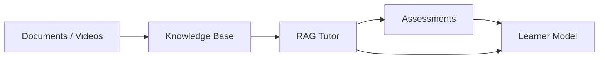

# Multimodal AI Hackathon 2026

## Track D — Personalized Tutoring & Adaptive Learning

## Overview
Build an AI study companion that unifies lecture videos, textbooks, and slides into a source-cited knowledge base, and uses it to run adaptive assessments and personalized tutoring.

## Core Features
- Unified source-cited knowledge base spanning multiple modalities (PDFs, slides, videos).
- Generative tutoring layer built with strict evidence-gating to prevent hallucination.
- Adaptive assessments backed directly by course material.
- Learner model maintaining long-term student mastery and weakness topics.

## System Architecture



## Project Structure
- `backend/` - FastAPI backend application containing the core tutor logic.
- `docs/` - Central project integration and architecture documentation.
- `scripts/` - Scripts for automated querying and evaluation.

## Prerequisites
- Python 3.10+
- (Optional) `google-genai` capable API Key for live testing.

## Environment Variables
The application uses the `GEMINI_API_KEY` for generative capabilities. 

Example only (place in `backend/.env`):
```env
GEMINI_API_KEY=your_gemini_api_key_here
```
*(Never include the real key in source code).*

## Local Setup

### Running the Backend

1. Navigate to the backend directory:
   ```powershell
   cd backend
   ```
2. Activate the virtual environment:
   ```powershell
   .venv\Scripts\Activate.ps1
   ```
3. Set the Python path:
   ```powershell
   $env:PYTHONPATH="."
   ```
4. Start the application:
   ```powershell
   uvicorn app.main:app --port 8000
   ```
   The Tutor API will be available at `http://localhost:8000`.

### Running the Frontend
*Frontend setup commands are NOT YET IMPLEMENTED.*

## Testing

For automated end-to-end evaluation:
```powershell
cd backend
.venv\Scripts\Activate.ps1
$env:PYTHONPATH="."
python scripts/test_query.py
```
For more details, see [docs/TESTING.md](docs/TESTING.md).

## Team Architecture

- **Member 1 (Data Engineer):** Knowledge Base extraction and multimodal ingestion.
- **Member 2 (RAG + AI Tutor Engineer):** Generative tutoring, query rewriting, citation validation, and retrieval interfaces.
- **Member 3 (Assessment Engineer):** Grounded MCQ generation and assessment evaluation.
- **Member 4 (Learner Model Engineer):** Student mastery tracking and topic personalization.

## Integration Documentation

- [Member 1 Handoff](docs/MEMBER_1_HANDOFF.md)
- [Member 2 Handoff](docs/MEMBER_2_HANDOFF.md)
- [Member 3 Handoff](docs/MEMBER_3_HANDOFF.md)
- [Member 4 Handoff](docs/MEMBER_4_HANDOFF.md)
- [Central Integration](docs/INTEGRATION.md)
- [Testing Guidelines](docs/TESTING.md)

## Security
- **.env is local:** API keys are never committed.
- **Server-side Gemini configuration:** The backend safely isolates the Gemini API configuration.
- **Students do not provide Gemini credentials:** The UI lacks any API-key inputs.

## Known Limitations
- The Gemini Interactions API endpoint can intermittently return HTTP 503 (Service Unavailable) under rapid burst requests. Exponential backoff has been added to mitigate this.
- Cross-course referencing is intentionally disabled via strict `course_id` isolation.

## Demo
*No demo URL is currently available. Please run the backend locally.*
