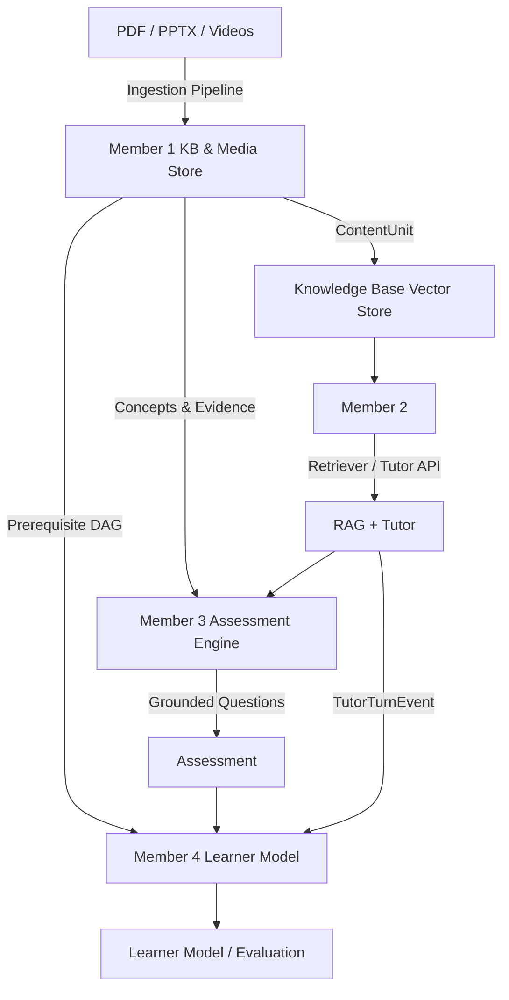

# Integration

This is the team's single source of truth for interfaces and boundaries.

## Actual Architecture

## Known Interfaces

### Member 1 → Member 2
**STATUS:** FULLY IMPLEMENTED
- **Interface:** Member 1 ingestion pipeline parses PDFs (with page numbers), PPTX slides (with slide numbers & notes), and Videos (with timestamps), extracts diagrams, and outputs `ContentUnit` objects defined in `app/tutor/models.py`. Vector indexing and `Retriever.retrieve()` are fully integrated.
- **Endpoints:** `POST /api/kb/upload`, `POST /api/kb/ingest`, `GET /api/kb/search`.

### Member 1 → Member 3
**STATUS:** FULLY IMPLEMENTED
- **Interface:** Member 1 exposes `GET /api/kb/courses/{course_id}/concepts` for question scoping, and `GET /api/kb/courses/{course_id}/concepts/{concept_id}/evidence` returning the concept node, all linked `ContentUnit` text chunks, and all linked `FigureUnit` diagrams for grounded MCQ/assessment generation.

### Member 1 → Member 4
**STATUS:** FULLY IMPLEMENTED
- **Interface:** Member 1 exposes `GET /api/kb/courses/{course_id}/prerequisites` providing the DAG of concept dependencies (with cycle resolution guaranteed) and `GET /api/kb/courses/{course_id}/learning_path` providing topological sort order for Bayesian Knowledge Tracing.

### Member 2 → Member 3
**STATUS:** IMPLEMENTED (Retrieval API defined, awaiting Member 3 generation)
- **Interface:** Member 3 calls `Retriever.retrieve()` to fetch source-grounded evidence to populate MCQs.

### Member 3 → Member 4
**STATUS:** NOT YET IMPLEMENTED
- **Interface:** Unknown. Member 3 must supply difficulty, student response, expected answer, and correctness to Member 4.

### Member 2 → Member 4
**STATUS:** IMPLEMENTED (Event schema defined, awaiting Member 4 consumption)
- **Interface:** Member 2 emits `TutorTurnEvent` (defined in `app/tutor/models.py`) containing the user query, grounded status, and topics touched.
