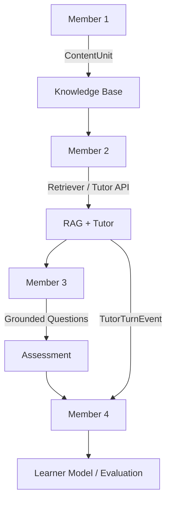

# Integration

This is the team's single source of truth for interfaces and boundaries.

## Actual Architecture

## Known Interfaces

### Member 1 → Member 2
**STATUS:** IMPLEMENTED (Schema defined, awaiting Member 1 mapping)
- **Interface:** Member 1 writes chunks adhering to `ContentUnit` defined in `app/tutor/models.py`.

### Member 2 → Member 3
**STATUS:** IMPLEMENTED (Retrieval API defined, awaiting Member 3 generation)
- **Interface:** Member 3 calls `Retriever.retrieve()` to fetch source-grounded evidence to populate MCQs.

### Member 3 → Member 4
**STATUS:** NOT YET IMPLEMENTED
- **Interface:** Unknown. Member 3 must supply difficulty, student response, expected answer, and correctness to Member 4.

### Member 2 → Member 4
**STATUS:** IMPLEMENTED (Event schema defined, awaiting Member 4 consumption)
- **Interface:** Member 2 emits `TutorTurnEvent` (defined in `app/tutor/models.py`) containing the user query, grounded status, and topics touched.
