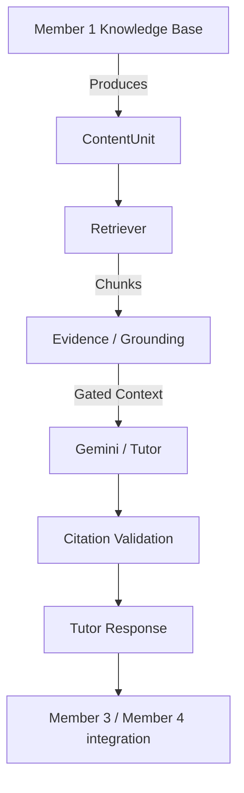

# Member 2 — RAG + AI Tutor Handoff

## 1. Role in System
Member 2 owns the RAG Tutor layer, serving as the bridge between the raw extracted Knowledge Base (Member 1) and the downstream assessment/learner clients (Members 3 & 4). It is responsible for source-grounded retrieval against `course_id` boundaries, follow-up query rewriting, generative tutoring using strict citation constraints, and evidence gating (refusing to answer ungrounded questions).

## 2. Architecture Flow



## 3. Retrieval Contract

The primary retrieval interface is exposed in `app/tutor/retriever.py` via the `Retriever` class.

**Method Signature:**
```python
def retrieve(
    self,
    course_id: str,
    query: str,
    top_k: int | None = None,
    filters: RetrievalFilters | None = None,
    min_score: float | None = None,
) -> list[RetrievedChunk]:
```

**Parameters:**
- `course_id`: (Required) Strict course isolation boundary.
- `query`: The user's query or assessment topic.
- `top_k`: Maximum chunks to return.
- `filters`: Strict metadata matching constraints (`topics`, `concepts`, `source_types`, `file_names`, `chunk_ids`).
- `min_score`: Relevance floor. Defaults to the embedder's baseline.

**Returned Structure (`RetrievedChunk` model):**
- `chunk_id` (str)
- `course_id` (str)
- `text` (str)
- `score` (float)
- `topic` (str | None)
- `concept` (str | None)
- `source` (SourceReference)

**Behaviors:**
- **Course Isolation:** Handled natively by supplying `course_id`.
- **Empty Results:** Returns an empty list if no chunks surpass `min_score` or `score > 0.0`.
- **Thresholds:** Chunks below threshold are completely discarded before routing.

## 4. Member 1 → Member 2 Contract

Member 1 must provide chunks adhering to the `ContentUnit` Pydantic schema in `app/tutor/models.py`.

**Required Fields:**
- `id` (str)
- `course_id` (str)
- `text` (str): 1 to 20,000 characters.
- `source` (SourceReference): Must have a discriminator `type` of `"pdf"`, `"slide"`, or `"video"`. 

**Source-Specific Provenance Fields:**
- PDF/Slide: requires `file_name`, optional `page`/`slide`.
- Video: requires `timestamp_start`, optional `timestamp_end`.

**Optional Fields:**
- `topic` (str)
- `concept` (str)
- `metadata` (dict)

## 5. Member 2 → Member 3 Contract

Member 3 (Assessment/Evaluation) should reuse Member 2's retrieval for generating strictly-grounded assessments.

**Integration Flow:**
1. **Assessment request:** "Generate an MCQ about `Photosynthesis`."
2. **Retriever.retrieve(...):** `retriever.retrieve(course_id="hackathon_course", query="Photosynthesis")`
3. **RetrievedChunk[]:** Returns `[RetrievedChunk(text="...", source=...)]`
4. **Evidence selection:** Member 3 selects the best chunk(s).
5. **Assessment generation:** Member 3 prompts its LLM using *only* the text from the selected chunks, propagating the chunk's `source` to the final MCQ answer citation.

## 6. Member 2 → Member 4 Contract

Member 4 (Learner Model) requires structured events to track student mastery. Member 2 emits the `TutorTurnEvent` after tutor responses.

**Fields Supplied by Member 2:**
- `user_id`, `course_id`, `conversation_id`, `message_id`
- `question`, `rewritten_query`
- `grounded` (bool)
- `topics`, `concepts` (from cited chunks)
- `cited_chunk_ids`

**Fields Member 3/4 Must Provide (Not in Tutor API):**
- Difficulty
- Expected answer
- Student response
- Correctness

## 7. API Reference

### `POST /api/tutor/ask`
**Request Body (`AskRequest`):**
- `session_id` (str) - Required
- `query` (str) - Required
- `level` (str) - Optional (default: "intermediate")
- `course_id` (str) - Optional (default: "hackathon_course")

**Response Body (`TutorAnswer`):**
- `answer` (str)
- `grounded` (bool)
- `citations` (list of `Citation`)
- `evidence_ids` (list of str)
- `evidence` (list of `EvidenceItem`)
- `unsupported_reason` (str | None)
- `outside_knowledge` (str | None)
- `related_topics` (list of str)

**Errors / Behaviors:**
- Returns HTTP 503 if tutor service not ready, 500 for runtime exceptions.
- **Grounding Behavior:** Returns 200 OK with `grounded: false` and `answer: "I couldn't find enough information..."` if evidence is insufficient.
- **Citations:** Stripped by `CitationValidator` if the LLM hallucinates an invalid label.

## 8. Conversation Memory

- **Handling:** Session dictionary stored in memory via `ConversationMemory`.
- **Query Rewriting:** Follow-up questions are prepended with history and sent to the LLM to yield a `standalone_query`.
- **Evidence Authority:** Conversational history is strictly tagged as *non-evidence* and used only for resolving intent. Factual generation relies exclusively on newly retrieved source chunks using the rewritten query.

## 9. Security and Grounding

- **Minimum Relevance:** `EvidenceGate` drops results failing the embedder's `default_min_score`.
- **Unsupported Material:** Yields safe fallback response; does not attempt to guess or hallucinate.
- **Citation Validation:** Any citation marker (`[S99]`) not mapping to a legitimately retrieved chunk label is stripped.
- **Prompt-Injection:** Injections inside source documents are treated strictly as passive context data.
- **Course Isolation:** Filtered strictly by `course_id` at the vector store level.
- **Empty KB:** Handled identically to unsupported queries.

## 10. Gemini Configuration

```env
GEMINI_API_KEY=your_gemini_api_key_here
```
- The Gemini key is a **SERVER-SIDE** developer configuration.
- Students/users do not provide the key via the UI.
- Developers running locally need their own key.
- `backend/.env` must **NEVER** be committed to the repository.

## 11. Local Setup

```powershell
cd backend
.venv\Scripts\Activate.ps1
$env:PYTHONPATH="."
uvicorn app.main:app --port 8000
```

## 12. Testing

**Unit / Suite Tests:**
```powershell
cd backend
.venv\Scripts\Activate.ps1
$env:PYTHONPATH="."
pytest -q
```

**End-to-End Query Verification:**
```powershell
cd backend
.venv\Scripts\Activate.ps1
$env:PYTHONPATH="."
python scripts/test_query.py
```

## 13. Known Limitations
- The Gemini service endpoint can occasionally return HTTP 503 (Service Unavailable) under rate limiting. Exponential backoff/retries have been implemented to mitigate this.

## 14. Integration Checklist
- [ ] Member 1: Verify data ingestion pipeline maps perfectly to `ContentUnit`.
- [ ] Member 3: Confirm retrieval interface usage for MCQ generation.
- [ ] Member 4: Connect to `TutorTurnEvent` telemetry stream.
